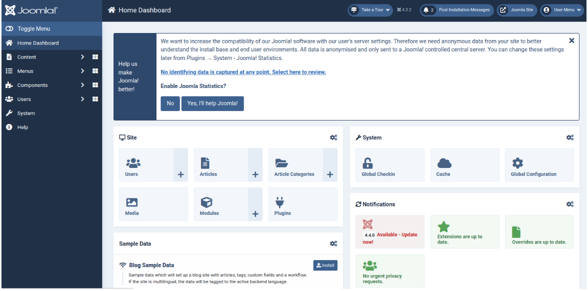

## Project setup Steps:

1. Setup for Windows:


2. Setup for Linux:
    
- Step 1 – Install LAMP Server
    - First, you must install Apache, MySQL, PHP, and other packages on your server. You can install all of them using the following command.
```bash
sudo apt install apache2 mysql-server php8.1 libapache2-mod-php8.1 php8.1-dev php8.1-bcmath php8.1-intl php8.1-soap php8.1-zip php8.1-curl php8.1-mbstring php8.1-mysql php8.1-gd php8.1-xml unzip -y
```
    - After the successful installation, start and enable Apache service with the following command.
```bash
systemctl start apache2
systemctl enable apache2
```
- Step 2 – Create a Database
    - Joomla uses MySQL as a database backend, so you will need to create a database and user for Joomla.

- Step 3 – Install Joomla CMS
    - First, visit the Joomla official website and download the latest version of Joomla using the wget command.
        ```bash
        sudo wget https://downloads.joomla.org/cms/joomla4/4-3-2/Joomla_4-3-2-Stable-Full_Package.zip
        ```
    - Once the download is finished, unzip the downloaded file to the Apache web root directory.
        ```bash
        unzip Joomla_4-3-2-Stable-Full_Package.zip -d /var/www/html/joomla
        ```
    - Next, change the ownership and permissions of the Joomla directory.

        ```bash
        sudo chown -R www-data:www-data /var/www/html/joomla/
        sudo chmod -R 755 /var/www/html/joomla/
        ```

- Step 4 – Configure Apache for Joomla
    - Next, create an Apache virtual host configuration file for Joomla.
        ```bash
        nano /etc/apache2/sites-available/joomla.conf
        ```
    - Add the following configurations.
        ```
        <VirtualHost *:8081>

        ServerAdmin webmaster@localhost

        DocumentRoot /var/www/html/joomla

        <Directory /var/www/html/joomla/>
                Options FollowSymlinks
                AllowOverride All
                Require all granted
        </Directory>

        ErrorLog ${APACHE_LOG_DIR}/example.com_error.log
        CustomLog ${APACHE_LOG_DIR}/example.com_access.log combined

        </VirtualHost>
        ```

    - Save and close the file, then activate the Joomla virtual host with the following command.
        ```bash
        sudo a2ensite joomla.conf
        ```
    - Finally, restart the Apache service to apply the changes.
        ```bash
        sudo systemctl restart apache2
        ```
- Step 5 – Access Joomla CMS
    - Now, open your web browser and access the Joomla CMS using the URL http://localhost:8081. You will see the language selection page.

        

    - Select your language and click on the Setup Login Data. You will see the following page.
        

    - Define your admin username and password and click on the Setup Database Connection. You will see the following page.

        
    

    - Provide your database settings and click on the Install Joomla button. Once the Joomla is installed, you will see the following page.

        

    - Click on the Open Administrator. You will see the Joomla login page.
    
        

    - Provide your admin username and password, and click on the login button. You will see the Joomla Dashboard on the following page.

        

    - Now, you can start using the Joomla CMS.


        
    
## Joomla component installation Steps:

1. Install Joomla component
    